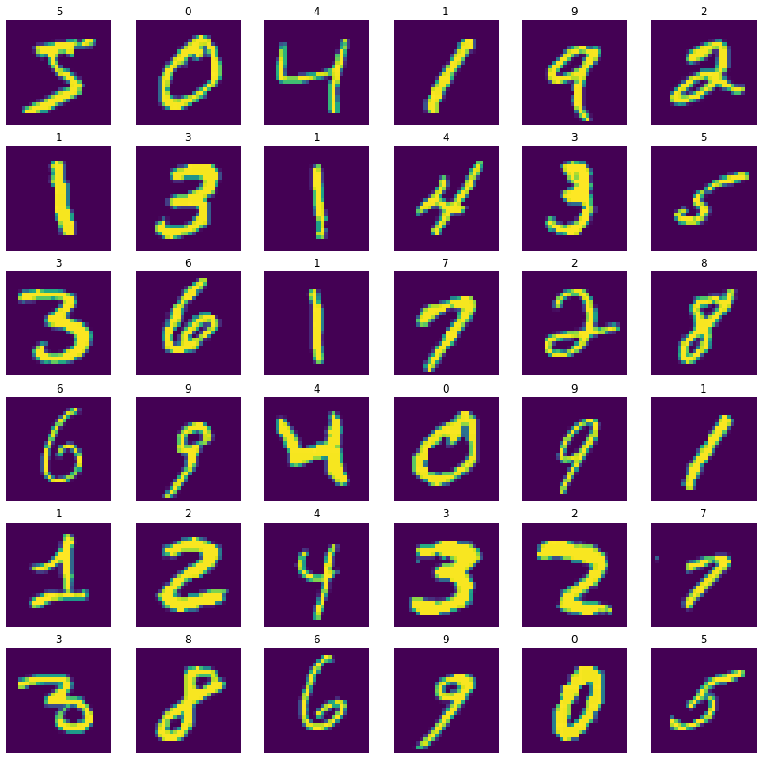
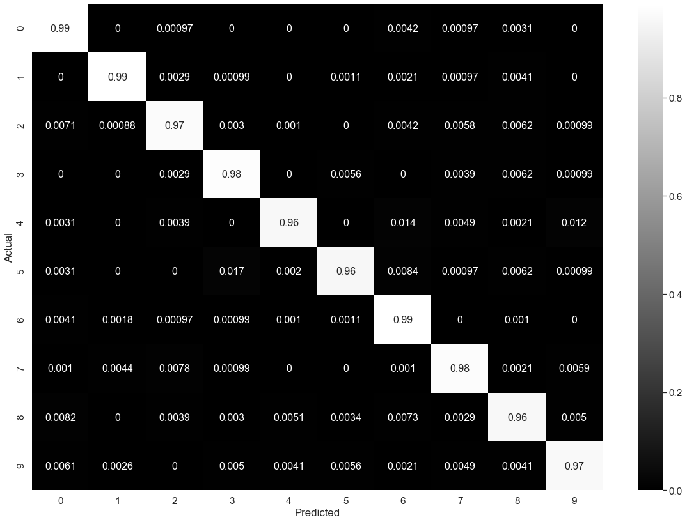
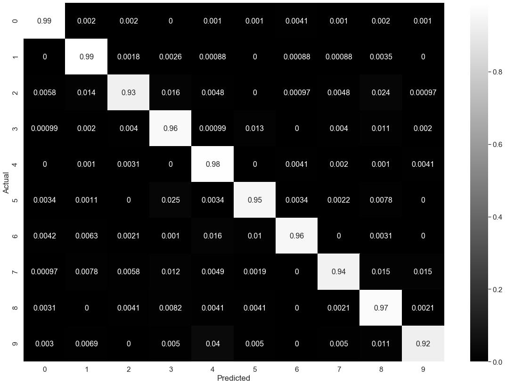

# Classifying Digits From Scratch

<div style='text-align: justify'>This notebook is a simple tutorial on how to use mlspear for classifying digits in the MNIST dataset. To evaluate how well it identifies digits, we will create a fully connected neural network from tensorflow 2.x with Keras, and use it as a baseline model for comparison.</div>


```python
import mlspear
import tensorflow as tf
```

## MNIST Dataset

<div style='text-align: justify'>To speed up the training process for neural networks, we first normalize the mnist dataset by dividing each entry by 255. That way, each instance has all entries between 0 and 1. </div>


```python
import matplotlib.pyplot as plt
import numpy as np

mnist_dataset = tf.keras.datasets.mnist

(X_train, y_train), (X_test, y_test) = mnist_dataset.load_data()
X_train, X_test = X_train / 255, X_test / 255
y_train = tf.keras.utils.to_categorical(y_train)
y_test  = tf.keras.utils.to_categorical(y_test)

fig, axes = plt.subplots(6, 6, figsize = (15, 15))

for row in range(0, 6):
    for col in range(0, 6):
        current_image = X_train[6 * row + col]
        axes[row, col].set_title(str(y_train[6 * row + col].argmax()))
        axes[row, col].axis('off')
        axes[row, col].imshow(current_image)
        
plt.show()
```





## Creating a Fully Connected Neural Network Classification Model using tensorflow 2.x with keras


```python
tf_model = tf.keras.Sequential()
tf_model.add(tf.keras.layers.Flatten(input_shape = (28, 28)))
tf_model.add(tf.keras.layers.Dense(128, activation = 'relu'))
tf_model.add(tf.keras.layers.Dense(10, activation = 'softmax'))

tf_model.compile(optimizer = 'adam', loss = 'categorical_crossentropy', metrics = ['accuracy'])
```


```python
history = tf_model.fit(X_train, y_train, epochs = 5, verbose = 0)
```


```python
y_predict = tf_model.predict(X_test)
_, tf_model_accuracy = tf_model.evaluate(X_test, y_test, verbose = 0)
print("accuracy: ", tf_model_accuracy)
```

    accuracy:  0.9771


## Defining a Plotting Function for a Confusion Matrix


```python
import pandas as pd
import seaborn as sns
import sklearn.metrics as sk_metrics

def confusion_plot(actuals, predictions):
    test_labels = actuals.argmax(axis = 1)
    pred_labels = predictions.argmax(axis = 1)
    confusion = sk_metrics.confusion_matrix(test_labels, pred_labels)
    confusion = confusion.astype("float") / confusion.sum(axis = 1)
    
    labels = [i for i in "0123456789"]
    df_cm = pd.DataFrame(confusion, index = labels, columns = labels)
    df_cm.index.name = 'Actual'
    df_cm.columns.name = 'Predicted'
    
    plt.figure(figsize = (20, 14))
    sns.set(font_scale = 1.4)
    sns.heatmap(df_cm, cmap = "gray", annot = True, annot_kws = {"size": 16})
    plt.show()
```

## Confusion Matrix For tf_model


```python
confusion_plot(y_test, y_predict)
```





## Creating a Fully Connected Neural Network Classification Model using mlspear


```python
mlspear_model = mlspear.NeuralNetwork([
    mlspear.NonOutputLayers.ReLU(28 * 28, 128), 
    mlspear.OutputLayers.Classification(128, 10)
], print_error = False)

X_train, X_test = X_train.reshape((-1, 28 * 28)), X_test.reshape((-1, 28 * 28))
```


```python
mlspear_model.train(X_train, y_train, 5, 0.001, batch_size = 32, optimizer = 'adam')
```

    Training Progress: 100%|██████████| 5/5 [50:47<00:00, 609.46s/it]


```python
y_predict = mlspear_model.predict(X_test)
mlspear_accuracy = mlspear.mlf.accuracy(y_predict, y_test)
print("accuracy: ", mlspear_accuracy)
```

    accuracy:  0.964


## Confusion Matrix For mlspear_model


```python
confusion_plot(y_test, y_predict)
```




