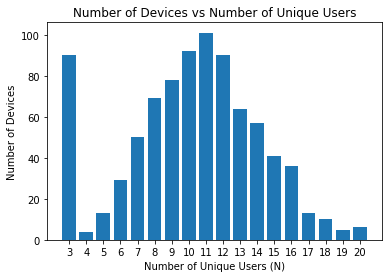
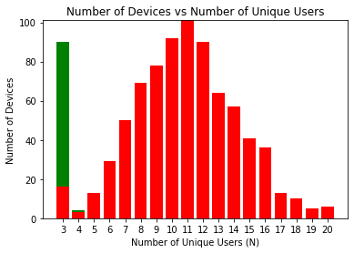
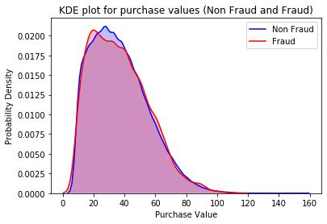
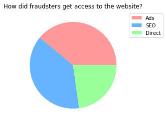
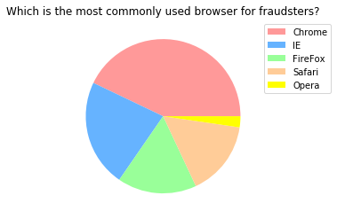
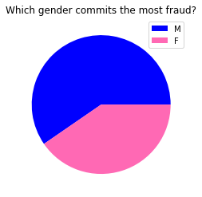
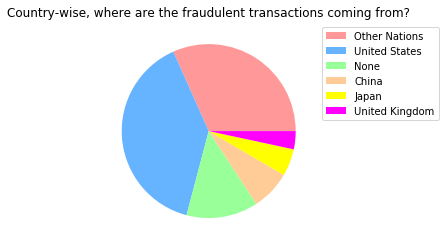

# Extracting The Country From The I.P Adress

Before we can do any data analysis and model creation, let us add a new column called 'country' in the fraud data table that indicates from which country did the user purchase the item. We can do this by using the ip_address table, i.e if an I.P address falls within a certain range, then we can find the country of origin.


```python
import pandas as pd
import numpy as np
import matplotlib.pyplot as plt
import seaborn as sns
import random

from datetime import datetime, time
import time
```


```python
fraud_data = pd.read_csv("Fraud_Data.csv")
ip_address_to_country = pd.read_csv("IpAddress_to_Country.csv")

display(fraud_data.head(5))
display(ip_address_to_country.head(5))
```


<div>

<table border="1" class="dataframe">
  <thead>
    <tr style="text-align: right;">
      <th></th>
      <th>user_id</th>
      <th>signup_time</th>
      <th>purchase_time</th>
      <th>purchase_value</th>
      <th>device_id</th>
      <th>source</th>
      <th>browser</th>
      <th>sex</th>
      <th>age</th>
      <th>ip_address</th>
      <th>class</th>
    </tr>
  </thead>
  <tbody>
    <tr>
      <th>0</th>
      <td>22058</td>
      <td>2015-02-24 22:55:49</td>
      <td>2015-04-18 02:47:11</td>
      <td>34</td>
      <td>QVPSPJUOCKZAR</td>
      <td>SEO</td>
      <td>Chrome</td>
      <td>M</td>
      <td>39</td>
      <td>7.327584e+08</td>
      <td>0</td>
    </tr>
    <tr>
      <th>1</th>
      <td>333320</td>
      <td>2015-06-07 20:39:50</td>
      <td>2015-06-08 01:38:54</td>
      <td>16</td>
      <td>EOGFQPIZPYXFZ</td>
      <td>Ads</td>
      <td>Chrome</td>
      <td>F</td>
      <td>53</td>
      <td>3.503114e+08</td>
      <td>0</td>
    </tr>
    <tr>
      <th>2</th>
      <td>1359</td>
      <td>2015-01-01 18:52:44</td>
      <td>2015-01-01 18:52:45</td>
      <td>15</td>
      <td>YSSKYOSJHPPLJ</td>
      <td>SEO</td>
      <td>Opera</td>
      <td>M</td>
      <td>53</td>
      <td>2.621474e+09</td>
      <td>1</td>
    </tr>
    <tr>
      <th>3</th>
      <td>150084</td>
      <td>2015-04-28 21:13:25</td>
      <td>2015-05-04 13:54:50</td>
      <td>44</td>
      <td>ATGTXKYKUDUQN</td>
      <td>SEO</td>
      <td>Safari</td>
      <td>M</td>
      <td>41</td>
      <td>3.840542e+09</td>
      <td>0</td>
    </tr>
    <tr>
      <th>4</th>
      <td>221365</td>
      <td>2015-07-21 07:09:52</td>
      <td>2015-09-09 18:40:53</td>
      <td>39</td>
      <td>NAUITBZFJKHWW</td>
      <td>Ads</td>
      <td>Safari</td>
      <td>M</td>
      <td>45</td>
      <td>4.155831e+08</td>
      <td>0</td>
    </tr>
  </tbody>
</table>
</div>


<div>

<table border="1" class="dataframe">
  <thead>
    <tr style="text-align: right;">
      <th></th>
      <th>lower_bound_ip_address</th>
      <th>upper_bound_ip_address</th>
      <th>country</th>
    </tr>
  </thead>
  <tbody>
    <tr>
      <th>0</th>
      <td>16777216.0</td>
      <td>16777471</td>
      <td>Australia</td>
    </tr>
    <tr>
      <th>1</th>
      <td>16777472.0</td>
      <td>16777727</td>
      <td>China</td>
    </tr>
    <tr>
      <th>2</th>
      <td>16777728.0</td>
      <td>16778239</td>
      <td>China</td>
    </tr>
    <tr>
      <th>3</th>
      <td>16778240.0</td>
      <td>16779263</td>
      <td>Australia</td>
    </tr>
    <tr>
      <th>4</th>
      <td>16779264.0</td>
      <td>16781311</td>
      <td>China</td>
    </tr>
  </tbody>
</table>
</div>


```python
def ip_to_country(ip_address):
    lower_bound = ip_address_to_country['lower_bound_ip_address'] <= ip_address
    upper_bound = ip_address_to_country['upper_bound_ip_address'] >= ip_address
    
    if len(ip_address_to_country[lower_bound & upper_bound]['country'].values) > 0:
        return ip_address_to_country[lower_bound & upper_bound]['country'].values[0]
    else:
        return 'None'
```


```python
start_time = time.time()
fraud_data['country'] = np.vectorize(ip_to_country)(fraud_data['ip_address'])
print("Time taken to complete process (seconds): %s" % (time.time() - start_time))
```

    Time taken to complete process (seconds): 444.6918411254883


```python
fraud_data.head(15)
```


<div>

<table border="1" class="dataframe">
  <thead>
    <tr style="text-align: right;">
      <th></th>
      <th>user_id</th>
      <th>signup_time</th>
      <th>purchase_time</th>
      <th>purchase_value</th>
      <th>device_id</th>
      <th>source</th>
      <th>browser</th>
      <th>sex</th>
      <th>age</th>
      <th>ip_address</th>
      <th>class</th>
      <th>country</th>
    </tr>
  </thead>
  <tbody>
    <tr>
      <th>0</th>
      <td>22058</td>
      <td>2015-02-24 22:55:49</td>
      <td>2015-04-18 02:47:11</td>
      <td>34</td>
      <td>QVPSPJUOCKZAR</td>
      <td>SEO</td>
      <td>Chrome</td>
      <td>M</td>
      <td>39</td>
      <td>7.327584e+08</td>
      <td>0</td>
      <td>Japan</td>
    </tr>
    <tr>
      <th>1</th>
      <td>333320</td>
      <td>2015-06-07 20:39:50</td>
      <td>2015-06-08 01:38:54</td>
      <td>16</td>
      <td>EOGFQPIZPYXFZ</td>
      <td>Ads</td>
      <td>Chrome</td>
      <td>F</td>
      <td>53</td>
      <td>3.503114e+08</td>
      <td>0</td>
      <td>United States</td>
    </tr>
    <tr>
      <th>2</th>
      <td>1359</td>
      <td>2015-01-01 18:52:44</td>
      <td>2015-01-01 18:52:45</td>
      <td>15</td>
      <td>YSSKYOSJHPPLJ</td>
      <td>SEO</td>
      <td>Opera</td>
      <td>M</td>
      <td>53</td>
      <td>2.621474e+09</td>
      <td>1</td>
      <td>United States</td>
    </tr>
    <tr>
      <th>3</th>
      <td>150084</td>
      <td>2015-04-28 21:13:25</td>
      <td>2015-05-04 13:54:50</td>
      <td>44</td>
      <td>ATGTXKYKUDUQN</td>
      <td>SEO</td>
      <td>Safari</td>
      <td>M</td>
      <td>41</td>
      <td>3.840542e+09</td>
      <td>0</td>
      <td>None</td>
    </tr>
    <tr>
      <th>4</th>
      <td>221365</td>
      <td>2015-07-21 07:09:52</td>
      <td>2015-09-09 18:40:53</td>
      <td>39</td>
      <td>NAUITBZFJKHWW</td>
      <td>Ads</td>
      <td>Safari</td>
      <td>M</td>
      <td>45</td>
      <td>4.155831e+08</td>
      <td>0</td>
      <td>United States</td>
    </tr>
    <tr>
      <th>5</th>
      <td>159135</td>
      <td>2015-05-21 06:03:03</td>
      <td>2015-07-09 08:05:14</td>
      <td>42</td>
      <td>ALEYXFXINSXLZ</td>
      <td>Ads</td>
      <td>Chrome</td>
      <td>M</td>
      <td>18</td>
      <td>2.809315e+09</td>
      <td>0</td>
      <td>Canada</td>
    </tr>
    <tr>
      <th>6</th>
      <td>50116</td>
      <td>2015-08-01 22:40:52</td>
      <td>2015-08-27 03:37:57</td>
      <td>11</td>
      <td>IWKVZHJOCLPUR</td>
      <td>Ads</td>
      <td>Chrome</td>
      <td>F</td>
      <td>19</td>
      <td>3.987484e+09</td>
      <td>0</td>
      <td>None</td>
    </tr>
    <tr>
      <th>7</th>
      <td>360585</td>
      <td>2015-04-06 07:35:45</td>
      <td>2015-05-25 17:21:14</td>
      <td>27</td>
      <td>HPUCUYLMJBYFW</td>
      <td>Ads</td>
      <td>Opera</td>
      <td>M</td>
      <td>34</td>
      <td>1.692459e+09</td>
      <td>0</td>
      <td>United States</td>
    </tr>
    <tr>
      <th>8</th>
      <td>159045</td>
      <td>2015-04-21 23:38:34</td>
      <td>2015-06-02 14:01:54</td>
      <td>30</td>
      <td>ILXYDOZIHOOHT</td>
      <td>SEO</td>
      <td>IE</td>
      <td>F</td>
      <td>43</td>
      <td>3.719094e+09</td>
      <td>0</td>
      <td>China</td>
    </tr>
    <tr>
      <th>9</th>
      <td>182338</td>
      <td>2015-01-25 17:49:49</td>
      <td>2015-03-23 23:05:42</td>
      <td>62</td>
      <td>NRFFPPHZYFUVC</td>
      <td>Ads</td>
      <td>IE</td>
      <td>M</td>
      <td>31</td>
      <td>3.416747e+08</td>
      <td>0</td>
      <td>United States</td>
    </tr>
    <tr>
      <th>10</th>
      <td>199700</td>
      <td>2015-07-11 18:26:54</td>
      <td>2015-10-28 21:59:40</td>
      <td>13</td>
      <td>TEPSJVVXGNTYR</td>
      <td>Ads</td>
      <td>Safari</td>
      <td>F</td>
      <td>35</td>
      <td>1.819009e+09</td>
      <td>0</td>
      <td>United States</td>
    </tr>
    <tr>
      <th>11</th>
      <td>73884</td>
      <td>2015-05-29 16:22:02</td>
      <td>2015-06-16 05:45:58</td>
      <td>58</td>
      <td>ZTZZJUCRDOCJZ</td>
      <td>Direct</td>
      <td>Chrome</td>
      <td>M</td>
      <td>32</td>
      <td>4.038285e+09</td>
      <td>0</td>
      <td>None</td>
    </tr>
    <tr>
      <th>12</th>
      <td>79203</td>
      <td>2015-06-16 21:19:35</td>
      <td>2015-06-21 03:29:59</td>
      <td>18</td>
      <td>IBPNKSMCKUZWD</td>
      <td>SEO</td>
      <td>Safari</td>
      <td>M</td>
      <td>33</td>
      <td>4.161541e+09</td>
      <td>0</td>
      <td>None</td>
    </tr>
    <tr>
      <th>13</th>
      <td>299320</td>
      <td>2015-03-03 19:17:07</td>
      <td>2015-04-05 12:32:36</td>
      <td>50</td>
      <td>RMKQNVEWGTWPC</td>
      <td>Direct</td>
      <td>Safari</td>
      <td>M</td>
      <td>38</td>
      <td>3.178510e+09</td>
      <td>0</td>
      <td>Brazil</td>
    </tr>
    <tr>
      <th>14</th>
      <td>82931</td>
      <td>2015-02-16 02:50:30</td>
      <td>2015-04-16 00:56:47</td>
      <td>15</td>
      <td>XKIFNYUZMBWFU</td>
      <td>SEO</td>
      <td>IE</td>
      <td>M</td>
      <td>24</td>
      <td>4.203488e+09</td>
      <td>0</td>
      <td>None</td>
    </tr>
  </tbody>
</table>
</div>


```python
#Save the fraud data with country column
fraud_data.to_csv("fraud_data_with_country.csv")
```

To save a bit of time, there is a file called fraud_data_with_country that is the result of running the above cells. If it takes too long to find the country from the ip address for 151,000 rows, simply run the cell below.


```python
#If fraud_data_with_country.csv file exists simply load it into a dataframe
fraud_data = pd.read_csv("fraud_data_with_country.csv", index_col = 0)
```

# Exploratory Data Analysis


```python
print("Number of Rows: \t\t" + str(len(fraud_data)))
print("Number of Unique User IDs: \t" + str(len(fraud_data.index.unique())))
print("Number of Unique Device IDs: \t" + str(len(fraud_data['device_id'].unique())))
```

    Number of Rows: 		151112
    Number of Unique User IDs: 	151112
    Number of Unique Device IDs: 	137956


Based on the above table, we can conclude that there exists at least one device that is used by multiple users. If there are multiple users that try to make a transaction from the same device, then the transaction might be fraudulent. Let's take a sample of  the devices where there were used by more than 2 users.


```python
device_ids = (fraud_data.groupby('device_id')['user_id'].count() > 1)
duplicated_device_ids = np.array(device_ids[device_ids == True].index)
np.random.shuffle(duplicated_device_ids)

for device_id in duplicated_device_ids[0:10]:
    if len(fraud_data[fraud_data['device_id'] == device_id]) > 2:
        display(fraud_data[fraud_data['device_id'] == device_id])
```


<div>

<table border="1" class="dataframe">
  <thead>
    <tr style="text-align: right;">
      <th></th>
      <th>user_id</th>
      <th>signup_time</th>
      <th>purchase_time</th>
      <th>purchase_value</th>
      <th>device_id</th>
      <th>source</th>
      <th>browser</th>
      <th>sex</th>
      <th>age</th>
      <th>ip_address</th>
      <th>class</th>
      <th>country</th>
    </tr>
  </thead>
  <tbody>
    <tr>
      <th>16080</th>
      <td>89282</td>
      <td>2015-01-12 05:38:30</td>
      <td>2015-01-12 05:38:31</td>
      <td>10</td>
      <td>VGCGSGCJILYYI</td>
      <td>Direct</td>
      <td>Chrome</td>
      <td>M</td>
      <td>39</td>
      <td>3.744589e+09</td>
      <td>1</td>
      <td>Korea Republic of</td>
    </tr>
    <tr>
      <th>28029</th>
      <td>56660</td>
      <td>2015-01-12 05:38:28</td>
      <td>2015-01-12 05:38:29</td>
      <td>10</td>
      <td>VGCGSGCJILYYI</td>
      <td>Direct</td>
      <td>Chrome</td>
      <td>M</td>
      <td>39</td>
      <td>3.744589e+09</td>
      <td>1</td>
      <td>Korea Republic of</td>
    </tr>
    <tr>
      <th>29457</th>
      <td>196694</td>
      <td>2015-01-12 05:38:31</td>
      <td>2015-01-12 05:38:32</td>
      <td>10</td>
      <td>VGCGSGCJILYYI</td>
      <td>Direct</td>
      <td>Chrome</td>
      <td>M</td>
      <td>39</td>
      <td>3.744589e+09</td>
      <td>1</td>
      <td>Korea Republic of</td>
    </tr>
    <tr>
      <th>37861</th>
      <td>390533</td>
      <td>2015-01-12 05:38:26</td>
      <td>2015-03-24 05:42:39</td>
      <td>10</td>
      <td>VGCGSGCJILYYI</td>
      <td>Direct</td>
      <td>Chrome</td>
      <td>M</td>
      <td>39</td>
      <td>3.744589e+09</td>
      <td>0</td>
      <td>Korea Republic of</td>
    </tr>
    <tr>
      <th>81068</th>
      <td>228713</td>
      <td>2015-01-12 05:38:32</td>
      <td>2015-01-12 05:38:33</td>
      <td>10</td>
      <td>VGCGSGCJILYYI</td>
      <td>Direct</td>
      <td>Chrome</td>
      <td>M</td>
      <td>39</td>
      <td>3.744589e+09</td>
      <td>1</td>
      <td>Korea Republic of</td>
    </tr>
    <tr>
      <th>94498</th>
      <td>39903</td>
      <td>2015-01-12 05:38:27</td>
      <td>2015-01-12 05:38:28</td>
      <td>10</td>
      <td>VGCGSGCJILYYI</td>
      <td>Direct</td>
      <td>Chrome</td>
      <td>M</td>
      <td>39</td>
      <td>3.744589e+09</td>
      <td>1</td>
      <td>Korea Republic of</td>
    </tr>
    <tr>
      <th>97853</th>
      <td>13822</td>
      <td>2015-01-12 05:38:35</td>
      <td>2015-01-12 05:38:36</td>
      <td>10</td>
      <td>VGCGSGCJILYYI</td>
      <td>Direct</td>
      <td>Chrome</td>
      <td>M</td>
      <td>39</td>
      <td>3.744589e+09</td>
      <td>1</td>
      <td>Korea Republic of</td>
    </tr>
    <tr>
      <th>100964</th>
      <td>222104</td>
      <td>2015-01-12 05:38:29</td>
      <td>2015-01-12 05:38:30</td>
      <td>10</td>
      <td>VGCGSGCJILYYI</td>
      <td>Direct</td>
      <td>Chrome</td>
      <td>M</td>
      <td>39</td>
      <td>3.744589e+09</td>
      <td>1</td>
      <td>Korea Republic of</td>
    </tr>
    <tr>
      <th>109669</th>
      <td>173800</td>
      <td>2015-01-12 05:38:34</td>
      <td>2015-01-12 05:38:35</td>
      <td>10</td>
      <td>VGCGSGCJILYYI</td>
      <td>Direct</td>
      <td>Chrome</td>
      <td>M</td>
      <td>39</td>
      <td>3.744589e+09</td>
      <td>1</td>
      <td>Korea Republic of</td>
    </tr>
    <tr>
      <th>140752</th>
      <td>164891</td>
      <td>2015-01-12 05:38:33</td>
      <td>2015-01-12 05:38:34</td>
      <td>10</td>
      <td>VGCGSGCJILYYI</td>
      <td>Direct</td>
      <td>Chrome</td>
      <td>M</td>
      <td>39</td>
      <td>3.744589e+09</td>
      <td>1</td>
      <td>Korea Republic of</td>
    </tr>
  </tbody>
</table>
</div>


<div>

<table border="1" class="dataframe">
  <thead>
    <tr style="text-align: right;">
      <th></th>
      <th>user_id</th>
      <th>signup_time</th>
      <th>purchase_time</th>
      <th>purchase_value</th>
      <th>device_id</th>
      <th>source</th>
      <th>browser</th>
      <th>sex</th>
      <th>age</th>
      <th>ip_address</th>
      <th>class</th>
      <th>country</th>
    </tr>
  </thead>
  <tbody>
    <tr>
      <th>14202</th>
      <td>94701</td>
      <td>2015-01-05 08:08:37</td>
      <td>2015-01-05 08:08:38</td>
      <td>12</td>
      <td>ROGEGTJRATEKV</td>
      <td>SEO</td>
      <td>Opera</td>
      <td>M</td>
      <td>37</td>
      <td>2.751388e+09</td>
      <td>1</td>
      <td>United States</td>
    </tr>
    <tr>
      <th>49546</th>
      <td>143809</td>
      <td>2015-01-05 08:08:35</td>
      <td>2015-01-05 08:08:36</td>
      <td>12</td>
      <td>ROGEGTJRATEKV</td>
      <td>SEO</td>
      <td>Opera</td>
      <td>M</td>
      <td>37</td>
      <td>2.751388e+09</td>
      <td>1</td>
      <td>United States</td>
    </tr>
    <tr>
      <th>57356</th>
      <td>163168</td>
      <td>2015-01-05 08:08:32</td>
      <td>2015-01-19 10:13:44</td>
      <td>12</td>
      <td>ROGEGTJRATEKV</td>
      <td>SEO</td>
      <td>Opera</td>
      <td>M</td>
      <td>37</td>
      <td>2.751388e+09</td>
      <td>0</td>
      <td>United States</td>
    </tr>
    <tr>
      <th>59514</th>
      <td>190985</td>
      <td>2015-01-05 08:08:43</td>
      <td>2015-01-05 08:08:44</td>
      <td>12</td>
      <td>ROGEGTJRATEKV</td>
      <td>SEO</td>
      <td>Opera</td>
      <td>M</td>
      <td>37</td>
      <td>2.751388e+09</td>
      <td>1</td>
      <td>United States</td>
    </tr>
    <tr>
      <th>69932</th>
      <td>50055</td>
      <td>2015-01-05 08:08:38</td>
      <td>2015-01-05 08:08:39</td>
      <td>12</td>
      <td>ROGEGTJRATEKV</td>
      <td>SEO</td>
      <td>Opera</td>
      <td>M</td>
      <td>37</td>
      <td>2.751388e+09</td>
      <td>1</td>
      <td>United States</td>
    </tr>
    <tr>
      <th>88237</th>
      <td>72269</td>
      <td>2015-01-05 08:08:40</td>
      <td>2015-01-05 08:08:41</td>
      <td>12</td>
      <td>ROGEGTJRATEKV</td>
      <td>SEO</td>
      <td>Opera</td>
      <td>M</td>
      <td>37</td>
      <td>2.751388e+09</td>
      <td>1</td>
      <td>United States</td>
    </tr>
    <tr>
      <th>89781</th>
      <td>315717</td>
      <td>2015-01-05 08:08:36</td>
      <td>2015-01-05 08:08:37</td>
      <td>12</td>
      <td>ROGEGTJRATEKV</td>
      <td>SEO</td>
      <td>Opera</td>
      <td>M</td>
      <td>37</td>
      <td>2.751388e+09</td>
      <td>1</td>
      <td>United States</td>
    </tr>
    <tr>
      <th>110523</th>
      <td>264878</td>
      <td>2015-01-05 08:08:34</td>
      <td>2015-01-05 08:08:35</td>
      <td>12</td>
      <td>ROGEGTJRATEKV</td>
      <td>SEO</td>
      <td>Opera</td>
      <td>M</td>
      <td>37</td>
      <td>2.751388e+09</td>
      <td>1</td>
      <td>United States</td>
    </tr>
    <tr>
      <th>124254</th>
      <td>9168</td>
      <td>2015-01-05 08:08:41</td>
      <td>2015-01-05 08:08:42</td>
      <td>12</td>
      <td>ROGEGTJRATEKV</td>
      <td>SEO</td>
      <td>Opera</td>
      <td>M</td>
      <td>37</td>
      <td>2.751388e+09</td>
      <td>1</td>
      <td>United States</td>
    </tr>
    <tr>
      <th>126713</th>
      <td>328379</td>
      <td>2015-01-05 08:08:33</td>
      <td>2015-01-05 08:08:34</td>
      <td>12</td>
      <td>ROGEGTJRATEKV</td>
      <td>SEO</td>
      <td>Opera</td>
      <td>M</td>
      <td>37</td>
      <td>2.751388e+09</td>
      <td>1</td>
      <td>United States</td>
    </tr>
    <tr>
      <th>128611</th>
      <td>380729</td>
      <td>2015-01-05 08:08:39</td>
      <td>2015-01-05 08:08:40</td>
      <td>12</td>
      <td>ROGEGTJRATEKV</td>
      <td>SEO</td>
      <td>Opera</td>
      <td>M</td>
      <td>37</td>
      <td>2.751388e+09</td>
      <td>1</td>
      <td>United States</td>
    </tr>
    <tr>
      <th>128671</th>
      <td>219587</td>
      <td>2015-01-05 08:08:42</td>
      <td>2015-01-05 08:08:43</td>
      <td>12</td>
      <td>ROGEGTJRATEKV</td>
      <td>SEO</td>
      <td>Opera</td>
      <td>M</td>
      <td>37</td>
      <td>2.751388e+09</td>
      <td>1</td>
      <td>United States</td>
    </tr>
    <tr>
      <th>130826</th>
      <td>67477</td>
      <td>2015-01-05 08:08:44</td>
      <td>2015-01-05 08:08:45</td>
      <td>12</td>
      <td>ROGEGTJRATEKV</td>
      <td>SEO</td>
      <td>Opera</td>
      <td>M</td>
      <td>37</td>
      <td>2.751388e+09</td>
      <td>1</td>
      <td>United States</td>
    </tr>
  </tbody>
</table>
</div>


<div>

<table border="1" class="dataframe">
  <thead>
    <tr style="text-align: right;">
      <th></th>
      <th>user_id</th>
      <th>signup_time</th>
      <th>purchase_time</th>
      <th>purchase_value</th>
      <th>device_id</th>
      <th>source</th>
      <th>browser</th>
      <th>sex</th>
      <th>age</th>
      <th>ip_address</th>
      <th>class</th>
      <th>country</th>
    </tr>
  </thead>
  <tbody>
    <tr>
      <th>6463</th>
      <td>232759</td>
      <td>2015-01-06 00:05:53</td>
      <td>2015-01-06 00:05:54</td>
      <td>15</td>
      <td>KLCMFZVFBRYOP</td>
      <td>Ads</td>
      <td>Chrome</td>
      <td>M</td>
      <td>36</td>
      <td>1.819146e+07</td>
      <td>1</td>
      <td>Japan</td>
    </tr>
    <tr>
      <th>26526</th>
      <td>326442</td>
      <td>2015-01-06 00:05:49</td>
      <td>2015-01-06 00:05:50</td>
      <td>15</td>
      <td>KLCMFZVFBRYOP</td>
      <td>Ads</td>
      <td>Chrome</td>
      <td>M</td>
      <td>36</td>
      <td>1.819146e+07</td>
      <td>1</td>
      <td>Japan</td>
    </tr>
    <tr>
      <th>70352</th>
      <td>201313</td>
      <td>2015-01-06 00:05:52</td>
      <td>2015-01-06 00:05:53</td>
      <td>15</td>
      <td>KLCMFZVFBRYOP</td>
      <td>Ads</td>
      <td>Chrome</td>
      <td>M</td>
      <td>36</td>
      <td>1.819146e+07</td>
      <td>1</td>
      <td>Japan</td>
    </tr>
    <tr>
      <th>100683</th>
      <td>330259</td>
      <td>2015-01-06 00:05:51</td>
      <td>2015-01-06 00:05:52</td>
      <td>15</td>
      <td>KLCMFZVFBRYOP</td>
      <td>Ads</td>
      <td>Chrome</td>
      <td>M</td>
      <td>36</td>
      <td>1.819146e+07</td>
      <td>1</td>
      <td>Japan</td>
    </tr>
    <tr>
      <th>104182</th>
      <td>293688</td>
      <td>2015-01-06 00:05:48</td>
      <td>2015-05-03 01:13:05</td>
      <td>15</td>
      <td>KLCMFZVFBRYOP</td>
      <td>Ads</td>
      <td>Chrome</td>
      <td>M</td>
      <td>36</td>
      <td>1.819146e+07</td>
      <td>0</td>
      <td>Japan</td>
    </tr>
    <tr>
      <th>135857</th>
      <td>59988</td>
      <td>2015-01-06 00:05:50</td>
      <td>2015-01-06 00:05:51</td>
      <td>15</td>
      <td>KLCMFZVFBRYOP</td>
      <td>Ads</td>
      <td>Chrome</td>
      <td>M</td>
      <td>36</td>
      <td>1.819146e+07</td>
      <td>1</td>
      <td>Japan</td>
    </tr>
  </tbody>
</table>
</div>


As I suspect, a device that is used by more than 2 users (or 10 users) is strongly correlated to a fraudulent transaction. Interestingly, after running the above cell multiple times, I notice that the time difference between signup and purchase time for fraudulent transactions is usually one second. This might be an important factor in determining whether a transaction is fraudulent. Let's add it to our fraud data before we analyse the devices that have more than 2 users.


```python
def date_diff_in_seconds(index):
    date1 = datetime.strptime(fraud_data.iloc[index]['signup_time'], '%Y-%m-%d %H:%M:%S')
    date2 = datetime.strptime(fraud_data.iloc[index]['purchase_time'], '%Y-%m-%d %H:%M:%S')
    time_delta = date2 - date1
    
    return time_delta.days * 24 * 3600 + time_delta.seconds

fraud_data['time_duration (secs)'] = np.vectorize(date_diff_in_seconds)(fraud_data.index)
fraud_data.head(5)
```


<div>

<table border="1" class="dataframe">
  <thead>
    <tr style="text-align: right;">
      <th></th>
      <th>user_id</th>
      <th>signup_time</th>
      <th>purchase_time</th>
      <th>purchase_value</th>
      <th>device_id</th>
      <th>source</th>
      <th>browser</th>
      <th>sex</th>
      <th>age</th>
      <th>ip_address</th>
      <th>class</th>
      <th>country</th>
      <th>time_duration (secs)</th>
    </tr>
  </thead>
  <tbody>
    <tr>
      <th>0</th>
      <td>22058</td>
      <td>2015-02-24 22:55:49</td>
      <td>2015-04-18 02:47:11</td>
      <td>34</td>
      <td>QVPSPJUOCKZAR</td>
      <td>SEO</td>
      <td>Chrome</td>
      <td>M</td>
      <td>39</td>
      <td>7.327584e+08</td>
      <td>0</td>
      <td>Japan</td>
      <td>4506682</td>
    </tr>
    <tr>
      <th>1</th>
      <td>333320</td>
      <td>2015-06-07 20:39:50</td>
      <td>2015-06-08 01:38:54</td>
      <td>16</td>
      <td>EOGFQPIZPYXFZ</td>
      <td>Ads</td>
      <td>Chrome</td>
      <td>F</td>
      <td>53</td>
      <td>3.503114e+08</td>
      <td>0</td>
      <td>United States</td>
      <td>17944</td>
    </tr>
    <tr>
      <th>2</th>
      <td>1359</td>
      <td>2015-01-01 18:52:44</td>
      <td>2015-01-01 18:52:45</td>
      <td>15</td>
      <td>YSSKYOSJHPPLJ</td>
      <td>SEO</td>
      <td>Opera</td>
      <td>M</td>
      <td>53</td>
      <td>2.621474e+09</td>
      <td>1</td>
      <td>United States</td>
      <td>1</td>
    </tr>
    <tr>
      <th>3</th>
      <td>150084</td>
      <td>2015-04-28 21:13:25</td>
      <td>2015-05-04 13:54:50</td>
      <td>44</td>
      <td>ATGTXKYKUDUQN</td>
      <td>SEO</td>
      <td>Safari</td>
      <td>M</td>
      <td>41</td>
      <td>3.840542e+09</td>
      <td>0</td>
      <td>None</td>
      <td>492085</td>
    </tr>
    <tr>
      <th>4</th>
      <td>221365</td>
      <td>2015-07-21 07:09:52</td>
      <td>2015-09-09 18:40:53</td>
      <td>39</td>
      <td>NAUITBZFJKHWW</td>
      <td>Ads</td>
      <td>Safari</td>
      <td>M</td>
      <td>45</td>
      <td>4.155831e+08</td>
      <td>0</td>
      <td>United States</td>
      <td>4361461</td>
    </tr>
  </tbody>
</table>
</div>


Now lets analyse the devices that have more than 2 users.


```python
num_unique_users_to_device_id \
= fraud_data[['user_id', 'device_id']].groupby('device_id').count()

num_unique_users_to_device_id.rename(columns = {'user_id': 'num_unique_user_ids'}, 
                                     inplace = True)

minimum_num_users = num_unique_users_to_device_id['num_unique_user_ids'].min()
maximum_num_users = num_unique_users_to_device_id['num_unique_user_ids'].max()

print("Minimum number of users per device id: %d" % minimum_num_users)
print("Maximum number of users per device id: %d" % maximum_num_users)

count_devices_to_num_users = []
for num_users in range(3, 21):
    num_user_condition = (num_unique_users_to_device_id['num_unique_user_ids'] 
                          == num_users)
    num = num_unique_users_to_device_id[num_user_condition].shape[0]
    count_devices_to_num_users.append(num)

plt.bar([x for x in range(3, 21)], count_devices_to_num_users)
plt.xticks([x for x in range(3, 21)])
plt.title("Number of Devices vs Number of Unique Users")
plt.xlabel("Number of Unique Users (N)")
plt.ylabel("Number of Devices")
plt.show()
```

    Minimum number of users per device id: 1
    Maximum number of users per device id: 20





The above cell simply generates a bar graph where the y-axis is the number of devices and the x-axis is the number of unique users using a device. What is interesting about this graph is that looks normally distributed where the mean number of users for a single device is about 11. For each number of unique users, we would like to know what proportion of the devices are associated to fraud. The next two cells will answer our question.


```python
device_id_is_fraudulant \
= fraud_data[['device_id', 'class']].groupby(['device_id']).agg(lambda x:x.value_counts().index[0])

fraud_user_condition = device_id_is_fraudulant['class'] == 1

count_devices_associated_with_fraud      = []
count_devices_to_num_users               = []
count_devices_not_associated_with_fraud  = []

for num_users in range(3, 21):
    num_user_condition = (num_unique_users_to_device_id['num_unique_user_ids'] == num_users)
  
    num = num_unique_users_to_device_id[num_user_condition].shape[0]
    count_devices_to_num_users.append(num)
  
    num_fraud = num_unique_users_to_device_id[num_user_condition & fraud_user_condition].shape[0]  
    count_devices_associated_with_fraud.append(num_fraud)
  
    count_devices_not_associated_with_fraud.append(num - num_fraud)
```


```python
plt.bar([x for x in range(3, 21)], count_devices_associated_with_fraud, color = 'red')
plt.bar([x for x in range(3, 21)], count_devices_not_associated_with_fraud,
        bottom = count_devices_associated_with_fraud, color = 'green')
plt.xticks([x for x in range(3, 21)])
plt.title("Number of Devices vs Number of Unique Users")
plt.xlabel("Number of Unique Users (N)")
plt.ylabel("Number of Devices")
plt.show()
```





Most devices that have 3 unique users are not associated to fraudulent transactions. A possible reason could be that there is a family (eg father, mother, and single child) sharing a single device. All devices that have 5 or more unique users are associated with fraud. This means that the number of unique users on a device is an important factor in detecting fraudulant transactions. Let us look at purchase value, and see if it is also an important feature in detecting fraud.


```python
non_fraudulent_transactions = fraud_data[fraud_data['class'] == 0]
fraudulent_transactions     = fraud_data[fraud_data['class'] == 1]

non_fraudulent_transactions['purchase_value']
sns.kdeplot(non_fraudulent_transactions['purchase_value'], shade = True, color = 'blue', label = "Non Fraud")
sns.kdeplot(fraudulent_transactions['purchase_value'], shade = True, color = 'red', label = "Fraud")

plt.title("KDE plot for purchase values (Non Fraud and Fraud)")
plt.ylabel("Probability Density")
plt.xlabel("Purchase Value")

plt.show()
```





The KDE plot demonstrates that the distribution between fraudulent and non fraudulent transactions, in terms of its purchase value, is very similar with one another. Therefore, purchase value on its own will not be useful in determining fraud based on the data that we have. Lets focus more on fraudelent transactions see what tools do fraudsters use to make a transaction.


```python
plt.pie(fraud_data[fraud_data['class'] == 1]['source'].value_counts(),
        colors = ['#ff9999','#66b3ff','#99ff99'])
plt.title("How did fraudsters get access to the website?")
plt.legend(['Ads', 'SEO', 'Direct'], bbox_to_anchor = (1.0, 1.0))
plt.show()
```





Most of them got access to the website through advertisements, and search engine optimizations.


```python
plt.pie(fraud_data[fraud_data['class'] == 1]['browser'].value_counts(),
        colors = ['#ff9999','#66b3ff','#99ff99','#ffcc98', 'yellow'])
plt.title("Which is the most commonly used browser for fraudsters?")
plt.legend(['Chrome', 'IE', 'FireFox', 'Safari', 'Opera'], bbox_to_anchor=(1.0, 1.0))
plt.show()
```





Most of them use Chrome, Internet Explorer, and FireFox as their browser to access the website.


```python
plt.pie(fraud_data[fraud_data['class'] == 1]['sex'].value_counts(), colors = ['blue', 'hotpink'])
plt.title("Which gender commits the most fraud?")
plt.legend(['M', 'F'])
plt.show()
```





Most fraudsters are male.


```python
series = fraud_data[fraud_data['class'] == 1]['country'].value_counts()
country_to_fraud_count = pd.DataFrame(series)
dictionary = {'Other Nations': 0}

for country in country_to_fraud_count.index:
    if country_to_fraud_count.loc[country].values[0] > 450:
        dictionary[country] = country_to_fraud_count.loc[country].values[0]
    else:
        dictionary['Other Nations'] += country_to_fraud_count.loc[country].values[0]

country_to_fraud_count = pd.Series(dictionary)
plt.pie(country_to_fraud_count,
        colors = ['#ff9999','#66b3ff','#99ff99','#ffcc98', 'yellow', 'magenta'])
plt.title("Country-wise, where are the fraudulent transactions coming from?")
plt.legend(['Other Nations', 'United States', 'None', 'China', 'Japan', 'United Kingdom'], bbox_to_anchor=(1.0, 1.0))
plt.show()
```





# Model Creation

## Preprocessing Step

As a preprocessing step, we will add the number of unique users column into our fraud_data dataframe. This number is associated to a device ID (i.e how many unique users are using a device).


```python
fraud_data['num_unique_users_for_device'] \
= fraud_data['device_id'].apply(lambda x: num_unique_users_to_device_id.loc[x])

fraud_data.head(10)
```


<div>

<table border="1" class="dataframe">
  <thead>
    <tr style="text-align: right;">
      <th></th>
      <th>user_id</th>
      <th>signup_time</th>
      <th>purchase_time</th>
      <th>purchase_value</th>
      <th>device_id</th>
      <th>source</th>
      <th>browser</th>
      <th>sex</th>
      <th>age</th>
      <th>ip_address</th>
      <th>class</th>
      <th>country</th>
      <th>time_duration (secs)</th>
      <th>num_unique_users_for_device</th>
    </tr>
  </thead>
  <tbody>
    <tr>
      <th>0</th>
      <td>22058</td>
      <td>2015-02-24 22:55:49</td>
      <td>2015-04-18 02:47:11</td>
      <td>34</td>
      <td>QVPSPJUOCKZAR</td>
      <td>SEO</td>
      <td>Chrome</td>
      <td>M</td>
      <td>39</td>
      <td>7.327584e+08</td>
      <td>0</td>
      <td>Japan</td>
      <td>4506682</td>
      <td>1</td>
    </tr>
    <tr>
      <th>1</th>
      <td>333320</td>
      <td>2015-06-07 20:39:50</td>
      <td>2015-06-08 01:38:54</td>
      <td>16</td>
      <td>EOGFQPIZPYXFZ</td>
      <td>Ads</td>
      <td>Chrome</td>
      <td>F</td>
      <td>53</td>
      <td>3.503114e+08</td>
      <td>0</td>
      <td>United States</td>
      <td>17944</td>
      <td>1</td>
    </tr>
    <tr>
      <th>2</th>
      <td>1359</td>
      <td>2015-01-01 18:52:44</td>
      <td>2015-01-01 18:52:45</td>
      <td>15</td>
      <td>YSSKYOSJHPPLJ</td>
      <td>SEO</td>
      <td>Opera</td>
      <td>M</td>
      <td>53</td>
      <td>2.621474e+09</td>
      <td>1</td>
      <td>United States</td>
      <td>1</td>
      <td>12</td>
    </tr>
    <tr>
      <th>3</th>
      <td>150084</td>
      <td>2015-04-28 21:13:25</td>
      <td>2015-05-04 13:54:50</td>
      <td>44</td>
      <td>ATGTXKYKUDUQN</td>
      <td>SEO</td>
      <td>Safari</td>
      <td>M</td>
      <td>41</td>
      <td>3.840542e+09</td>
      <td>0</td>
      <td>None</td>
      <td>492085</td>
      <td>1</td>
    </tr>
    <tr>
      <th>4</th>
      <td>221365</td>
      <td>2015-07-21 07:09:52</td>
      <td>2015-09-09 18:40:53</td>
      <td>39</td>
      <td>NAUITBZFJKHWW</td>
      <td>Ads</td>
      <td>Safari</td>
      <td>M</td>
      <td>45</td>
      <td>4.155831e+08</td>
      <td>0</td>
      <td>United States</td>
      <td>4361461</td>
      <td>1</td>
    </tr>
    <tr>
      <th>5</th>
      <td>159135</td>
      <td>2015-05-21 06:03:03</td>
      <td>2015-07-09 08:05:14</td>
      <td>42</td>
      <td>ALEYXFXINSXLZ</td>
      <td>Ads</td>
      <td>Chrome</td>
      <td>M</td>
      <td>18</td>
      <td>2.809315e+09</td>
      <td>0</td>
      <td>Canada</td>
      <td>4240931</td>
      <td>1</td>
    </tr>
    <tr>
      <th>6</th>
      <td>50116</td>
      <td>2015-08-01 22:40:52</td>
      <td>2015-08-27 03:37:57</td>
      <td>11</td>
      <td>IWKVZHJOCLPUR</td>
      <td>Ads</td>
      <td>Chrome</td>
      <td>F</td>
      <td>19</td>
      <td>3.987484e+09</td>
      <td>0</td>
      <td>None</td>
      <td>2177825</td>
      <td>1</td>
    </tr>
    <tr>
      <th>7</th>
      <td>360585</td>
      <td>2015-04-06 07:35:45</td>
      <td>2015-05-25 17:21:14</td>
      <td>27</td>
      <td>HPUCUYLMJBYFW</td>
      <td>Ads</td>
      <td>Opera</td>
      <td>M</td>
      <td>34</td>
      <td>1.692459e+09</td>
      <td>0</td>
      <td>United States</td>
      <td>4268729</td>
      <td>1</td>
    </tr>
    <tr>
      <th>8</th>
      <td>159045</td>
      <td>2015-04-21 23:38:34</td>
      <td>2015-06-02 14:01:54</td>
      <td>30</td>
      <td>ILXYDOZIHOOHT</td>
      <td>SEO</td>
      <td>IE</td>
      <td>F</td>
      <td>43</td>
      <td>3.719094e+09</td>
      <td>0</td>
      <td>China</td>
      <td>3594200</td>
      <td>1</td>
    </tr>
    <tr>
      <th>9</th>
      <td>182338</td>
      <td>2015-01-25 17:49:49</td>
      <td>2015-03-23 23:05:42</td>
      <td>62</td>
      <td>NRFFPPHZYFUVC</td>
      <td>Ads</td>
      <td>IE</td>
      <td>M</td>
      <td>31</td>
      <td>3.416747e+08</td>
      <td>0</td>
      <td>United States</td>
      <td>4943753</td>
      <td>1</td>
    </tr>
  </tbody>
</table>
</div>


Filter out the fraud dataframe so that have the columns that are of most interest in detecting fraud and one hot encode all categorical variables.


```python
columns_of_interest = ['num_unique_users_for_device', 'time_duration (secs)', 
                       'purchase_value', 'source','browser', 'sex', 'age', 
                       'country','class']

modified_fraud_data = fraud_data[columns_of_interest].copy()
modified_fraud_data = pd.get_dummies(modified_fraud_data)
column_list = list(modified_fraud_data)

for i in range(0,3):
    column_list[i], column_list[4] = column_list[4], column_list[i]
    
modified_fraud_data = modified_fraud_data[column_list]
modified_fraud_data.head(10)
```


<div>

<table border="1" class="dataframe">
  <thead>
    <tr style="text-align: right;">
      <th></th>
      <th>class</th>
      <th>num_unique_users_for_device</th>
      <th>time_duration (secs)</th>
      <th>age</th>
      <th>purchase_value</th>
      <th>source_Ads</th>
      <th>source_Direct</th>
      <th>source_SEO</th>
      <th>browser_Chrome</th>
      <th>browser_FireFox</th>
      <th>...</th>
      <th>country_United States</th>
      <th>country_Uruguay</th>
      <th>country_Uzbekistan</th>
      <th>country_Vanuatu</th>
      <th>country_Venezuela</th>
      <th>country_Viet Nam</th>
      <th>country_Virgin Islands (U.S.)</th>
      <th>country_Yemen</th>
      <th>country_Zambia</th>
      <th>country_Zimbabwe</th>
    </tr>
  </thead>
  <tbody>
    <tr>
      <th>0</th>
      <td>0</td>
      <td>1</td>
      <td>4506682</td>
      <td>39</td>
      <td>34</td>
      <td>0</td>
      <td>0</td>
      <td>1</td>
      <td>1</td>
      <td>0</td>
      <td>...</td>
      <td>0</td>
      <td>0</td>
      <td>0</td>
      <td>0</td>
      <td>0</td>
      <td>0</td>
      <td>0</td>
      <td>0</td>
      <td>0</td>
      <td>0</td>
    </tr>
    <tr>
      <th>1</th>
      <td>0</td>
      <td>1</td>
      <td>17944</td>
      <td>53</td>
      <td>16</td>
      <td>1</td>
      <td>0</td>
      <td>0</td>
      <td>1</td>
      <td>0</td>
      <td>...</td>
      <td>1</td>
      <td>0</td>
      <td>0</td>
      <td>0</td>
      <td>0</td>
      <td>0</td>
      <td>0</td>
      <td>0</td>
      <td>0</td>
      <td>0</td>
    </tr>
    <tr>
      <th>2</th>
      <td>1</td>
      <td>12</td>
      <td>1</td>
      <td>53</td>
      <td>15</td>
      <td>0</td>
      <td>0</td>
      <td>1</td>
      <td>0</td>
      <td>0</td>
      <td>...</td>
      <td>1</td>
      <td>0</td>
      <td>0</td>
      <td>0</td>
      <td>0</td>
      <td>0</td>
      <td>0</td>
      <td>0</td>
      <td>0</td>
      <td>0</td>
    </tr>
    <tr>
      <th>3</th>
      <td>0</td>
      <td>1</td>
      <td>492085</td>
      <td>41</td>
      <td>44</td>
      <td>0</td>
      <td>0</td>
      <td>1</td>
      <td>0</td>
      <td>0</td>
      <td>...</td>
      <td>0</td>
      <td>0</td>
      <td>0</td>
      <td>0</td>
      <td>0</td>
      <td>0</td>
      <td>0</td>
      <td>0</td>
      <td>0</td>
      <td>0</td>
    </tr>
    <tr>
      <th>4</th>
      <td>0</td>
      <td>1</td>
      <td>4361461</td>
      <td>45</td>
      <td>39</td>
      <td>1</td>
      <td>0</td>
      <td>0</td>
      <td>0</td>
      <td>0</td>
      <td>...</td>
      <td>1</td>
      <td>0</td>
      <td>0</td>
      <td>0</td>
      <td>0</td>
      <td>0</td>
      <td>0</td>
      <td>0</td>
      <td>0</td>
      <td>0</td>
    </tr>
    <tr>
      <th>5</th>
      <td>0</td>
      <td>1</td>
      <td>4240931</td>
      <td>18</td>
      <td>42</td>
      <td>1</td>
      <td>0</td>
      <td>0</td>
      <td>1</td>
      <td>0</td>
      <td>...</td>
      <td>0</td>
      <td>0</td>
      <td>0</td>
      <td>0</td>
      <td>0</td>
      <td>0</td>
      <td>0</td>
      <td>0</td>
      <td>0</td>
      <td>0</td>
    </tr>
    <tr>
      <th>6</th>
      <td>0</td>
      <td>1</td>
      <td>2177825</td>
      <td>19</td>
      <td>11</td>
      <td>1</td>
      <td>0</td>
      <td>0</td>
      <td>1</td>
      <td>0</td>
      <td>...</td>
      <td>0</td>
      <td>0</td>
      <td>0</td>
      <td>0</td>
      <td>0</td>
      <td>0</td>
      <td>0</td>
      <td>0</td>
      <td>0</td>
      <td>0</td>
    </tr>
    <tr>
      <th>7</th>
      <td>0</td>
      <td>1</td>
      <td>4268729</td>
      <td>34</td>
      <td>27</td>
      <td>1</td>
      <td>0</td>
      <td>0</td>
      <td>0</td>
      <td>0</td>
      <td>...</td>
      <td>1</td>
      <td>0</td>
      <td>0</td>
      <td>0</td>
      <td>0</td>
      <td>0</td>
      <td>0</td>
      <td>0</td>
      <td>0</td>
      <td>0</td>
    </tr>
    <tr>
      <th>8</th>
      <td>0</td>
      <td>1</td>
      <td>3594200</td>
      <td>43</td>
      <td>30</td>
      <td>0</td>
      <td>0</td>
      <td>1</td>
      <td>0</td>
      <td>0</td>
      <td>...</td>
      <td>0</td>
      <td>0</td>
      <td>0</td>
      <td>0</td>
      <td>0</td>
      <td>0</td>
      <td>0</td>
      <td>0</td>
      <td>0</td>
      <td>0</td>
    </tr>
    <tr>
      <th>9</th>
      <td>0</td>
      <td>1</td>
      <td>4943753</td>
      <td>31</td>
      <td>62</td>
      <td>1</td>
      <td>0</td>
      <td>0</td>
      <td>0</td>
      <td>0</td>
      <td>...</td>
      <td>1</td>
      <td>0</td>
      <td>0</td>
      <td>0</td>
      <td>0</td>
      <td>0</td>
      <td>0</td>
      <td>0</td>
      <td>0</td>
      <td>0</td>
    </tr>
  </tbody>
</table>
<p>10 rows × 197 columns</p>
</div>


## Logistic Regression


```python
from sklearn.model_selection import train_test_split
from sklearn.linear_model import LogisticRegression
from sklearn import preprocessing
from sklearn.metrics import recall_score, accuracy_score, f1_score, precision_score, roc_auc_score

x_train, x_val_test, y_train, y_val_test = train_test_split(modified_fraud_data[column_list[1:]], 
                                                            modified_fraud_data['class'],
                                                            test_size = 0.30)
x_val = x_val_test[0:len(x_val_test) // 2]
y_val = y_val_test[0:len(x_val_test) // 2]

x_test = x_val_test[len(x_val_test) // 2:]
y_test = y_val_test[len(x_val_test) // 2:]

scaler = preprocessing.MinMaxScaler()
scaler = scaler.fit(x_train)

x_train_minmax = scaler.transform(x_train)
x_val_minmax   = scaler.transform(x_val) 
x_test_minmax  = scaler.transform(x_test)
```

    /anaconda3/lib/python3.7/site-packages/sklearn/preprocessing/data.py:323: DataConversionWarning: Data with input dtype uint8, int64 were all converted to float64 by MinMaxScaler.
      return self.partial_fit(X, y)


```python
model = LogisticRegression(penalty = 'l1', C = 3)
```


```python
model.fit(x_train_minmax, y_train)
y_predict = model.predict(x_val_minmax)

print("Validation Results")
print("-------------")
print("Accurcay: \t %f"  %(accuracy_score(y_val, y_predict)))
print("Recall: \t %f"    %(recall_score(y_val, y_predict)))
print("F1 Score: \t %f"  %(f1_score(y_val, y_predict)))
print("Precision: \t %f" %(precision_score(y_val, y_predict)))
print("AUC score: \t %f" %(roc_auc_score(y_val, y_predict)))
```

    /anaconda3/lib/python3.7/site-packages/sklearn/linear_model/logistic.py:433: FutureWarning: Default solver will be changed to 'lbfgs' in 0.22. Specify a solver to silence this warning.
      FutureWarning)


    Validation Results
    -------------
    Accurcay: 	 0.951383
    Recall: 	 0.514656
    F1 Score: 	 0.660296
    Precision: 	 0.920894
    AUC score: 	 0.755094


```python
y_predict = model.predict(x_test_minmax)

print("Test Results")
print("-------------")
print("Accurcay: \t %f"  %(accuracy_score(y_test, y_predict)))
print("Recall: \t %f"    %(recall_score(y_test, y_predict)))
print("F1 Score: \t %f"  %(f1_score(y_test, y_predict)))
print("Precision: \t %f" %(precision_score(y_test, y_predict)))
print("AUC score: \t %f" %(roc_auc_score(y_test, y_predict)))
```

    Test Results
    -------------
    Accurcay: 	 0.951207
    Recall: 	 0.527897
    F1 Score: 	 0.666867
    Precision: 	 0.905151
    AUC score: 	 0.761129


```python
#Examine the weights in the logistic regression model (First 10)
predictors = column_list[1:]
print("Features \t\t\t\t Absolute Value Weight")
print("--------------------------------------------------------------")
for i, weight in enumerate(model.coef_[0, 0:10]):
    print("{:50s} {:10f}".format(predictors[i], abs(weight)))

#len(column_list[1:])
```

    Features 				 Absolute Value Weight
    --------------------------------------------------------------
    num_unique_users_for_device                         10.326834
    time_duration (secs)                                 0.608034
    age                                                  0.122542
    purchase_value                                       0.073701
    source_Ads                                           0.727852
    source_Direct                                        0.500312
    source_SEO                                           0.775373
    browser_Chrome                                       0.742193
    browser_FireFox                                      0.722369
    browser_IE                                           0.721169


## Decision Tree


```python
from sklearn.tree import DecisionTreeClassifier, export_graphviz

x_train, x_val_test, y_train, y_val_test = train_test_split(modified_fraud_data[column_list[1:]], 
                                                            modified_fraud_data['class'],
                                                            test_size = 0.30)
x_val = x_val_test[0:len(x_val_test) // 2]
y_val = y_val_test[0:len(x_val_test) // 2]

x_test = x_val_test[len(x_val_test) // 2:]
y_test = y_val_test[len(x_val_test) // 2:]
```


```python
model = DecisionTreeClassifier(criterion = 'entropy', max_depth = 10)
```


```python
_ = model.fit(x_train, y_train)
export_graphviz(model, out_file = "tree.dot", feature_names = column_list[1:], class_names = ['0', '1'])
# For the visual representation of the tree, look at tree.png file. The image file was generated by an online
# converter that uses graphviz.
```


```python
y_predict = model.predict(x_val)

print("Validation Results")
print("-------------")
print("Accurcay: \t %f"  %(accuracy_score(y_val, y_predict)))
print("Recall: \t %f"    %(recall_score(y_val, y_predict)))
print("F1 Score: \t %f"  %(f1_score(y_val, y_predict)))
print("Precision: \t %f" %(precision_score(y_val, y_predict)))
print("AUC score: \t %f" %(roc_auc_score(y_val, y_predict)))
```

    Validation Results
    -------------
    Accurcay: 	 0.954912
    Recall: 	 0.543260
    F1 Score: 	 0.700117
    Precision: 	 0.984323
    AUC score: 	 0.771166


```python
y_predict = model.predict(x_test)

print("Test Results")
print("-------------")
print("Accurcay: \t %f"  %(accuracy_score(y_test, y_predict)))
print("Recall: \t %f"    %(recall_score(y_test, y_predict)))
print("F1 Score: \t %f"  %(f1_score(y_test, y_predict)))
print("Precision: \t %f" %(precision_score(y_test, y_predict)))
print("AUC score: \t %f" %(roc_auc_score(y_test, y_predict)))
```

    Test Results
    -------------
    Accurcay: 	 0.957074
    Recall: 	 0.553688
    F1 Score: 	 0.709118
    Precision: 	 0.985869
    AUC score: 	 0.776430

